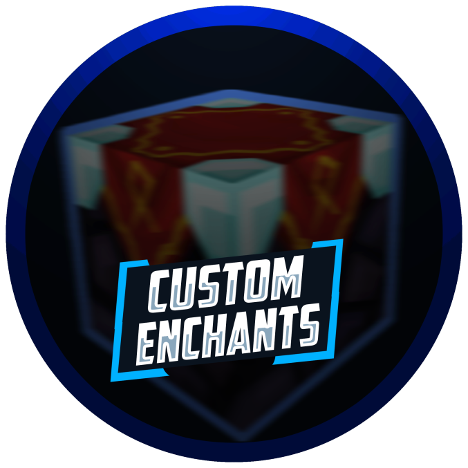

# Custom Enchants+

## Description

Custom Enchants+ is a custom enchantment plugin that offers many unique, never-seen-before enchantments. Some enchantments have been created by suggestions, creativity, and inspiration from other enchantments. This plugin allows **customization** for all enchantments.  

## Plugin Downloads & Changelogs

Spigot MC: [https://www.spigotmc.org/resources/custom-enchants-plus.72678/](https://www.spigotmc.org/resources/custom-enchants-plus.72678/)

## Features

* 35 [Custom Enchants](enchants.md)
* 5 [Scrolls](scrolls.md)
* 3 [Animated Custom Gui's](guis.md)
  * [Enchanter ](guis.md#the-enchanter)- Obtain Custom Enchantments
  * [Tinkerer ](guis.md#the-tinkerer)- Exchange Enchants for EXP
  * [Anvil ](guis.md#the-anvil)- Forge Items Together
* [Highly Configurable](configuration-files/)
* 1.12-1.15 Support
* [Advanced Commands](commands-and-permissions.md)
* No Hard Dependencies
* [ActionBar Integration](trivia.md#actionbar)
* [Custom Sounds](trivia.md#sounds-and-particles)
* [Custom Particles](trivia.md#sounds-and-particles)
* [Custom Blocks](custom-blocks.md)
* [bStats Integration](trivia.md#bstats)
* [Built-In API](api.md)
* [HolographicDisplays Integration](dependencies.md#holographicdisplays)
* [WorldGuard Integration](dependencies.md#worldguard)
* [Towny Integration](dependencies.md#towny)



















