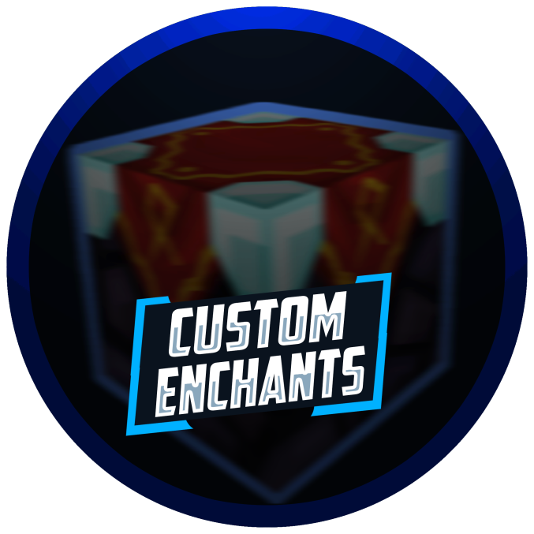

# Custom Enchants+

## Description

Custom Enchants+ is a custom enchantment plugin that offers many unique, never-seen-before enchantments. Some enchantments have been created by suggestions, creativity, and inspiration from other enchantments. This plugin allows **customization** for all enchantments.\

## Plugin Downloads & Changelogs

Spigot MC: [https://www.spigotmc.org/resources/custom-enchants-plus.72678/](https://www.spigotmc.org/resources/custom-enchants-plus.72678/)

## Features

* 40+ [Custom Enchants](enchants.md)
* 5 [Scrolls](scrolls.md)
* [Wands](wands.md)
* 3 [Animated Custom Gui's](guis.md)
  * [Enchanter ](guis.md#the-enchanter)- Obtain Custom Enchantments
  * [Tinkerer ](guis.md#the-tinkerer)- Exchange Enchants for EXP
  * [Anvil ](guis.md#the-anvil)- Forge Items Together
* [Highly Configurable](configuration-files/)
* 1.8.8-1.16.x Support
* [Advanced Commands](commands-and-permissions.md)
* No Hard Dependencies
* [ActionBar Integration](trivia.md#actionbar)
* [Custom Sounds](trivia.md#sounds-and-particles)
* [Custom Particles](trivia.md#sounds-and-particles)
* [Custom Blocks](custom-blocks.md)
* [bStats Integration](trivia.md#bstats)
* [Built-In API](api.md)
* [HolographicDisplays Integration](dependencies.md#holographicdisplays)


[api.md](api.md)



[commands-and-permissions.md](commands-and-permissions.md)



[configuration-files](configuration-files/)



[custom-blocks.md](custom-blocks.md)



[dependencies.md](dependencies.md)



[enchants.md](enchants.md)



[guis.md](guis.md)



[scrolls.md](scrolls.md)



[trivia.md](trivia.md)

