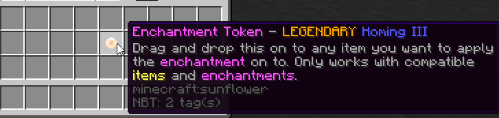

# Enchantments

## Enchanting

A player can access the [enchanter ](guis.md#the-enchanter)[GUI ](guis.md)by using /enchantingtable \(/ench\), by clicking on a [custom block](custom-blocks.md), or by using an [Enchantment Token](enchants.md#enchantment-tokens). Within the enchanter GUI, a player is able to add custom enchantments. An admin is also able to add custom enchantments with [commands](commands-and-permissions.md). All enchantments enchantments also hold a configurable [rarity ](enchants.md#rarities)and [lore](enchants.md#lores). Custom enchantments can also be acquired through the vanilla enchantment table, this can be customized in the [config.yml](../command-cooldown/configuration-files/config.yml.md). 

### Rarities

Every enchantment contains a rarity, defined in the [enchants.yml](configuration-files/enchants.yml.md). These rarities are harder to obtain, in ascending order: NORMAL, RARE, AND LEGENDARY. The percentage for each type of rarity is defined within the [config.yml](configuration-files/config.yml.md).

### Slots

Each enchantment uses a slot on the current item. The default max slots is defined within the config.yml. Max slots can be upgraded with the [Slot Upgrade Scroll](scrolls.md#slot-upgrade). Slots replaced the previous system of tiers.

### Lores

Each enchantment has a lore. Lores can be configured within the [lores.yml](configuration-files/untitled.md) config. Lores are displayed by this format...

```text
[Enchantment Name] [Level]
[Lore, Line 1]
[Lore, Line 2]
...
```

Enchantment levels are displayed in roman numerals.

#### Lore Updater

When the lores.yml file is changed, all custom enchanted items will be updated to the same format. The updater is ran when a player joins, a player opens an inventory, and when the `/ce updateitems [player]` command is ran. The lore updater will run through the inventories of chests when opened. The lore updater was implemented in update [v3.0 BETA](https://www.spigotmc.org/resources/%E2%9C%A8custom-enchants-plus-35-enchants-scrolls-actionbar-1-12-1-15%E2%9C%A8.72678/update?update=333093). It was proven useful because v3.0 introduced [slots](enchants.md#slots), so there were no major bugs within the lore. The lore updater also works on [Scrolls](scrolls.md). The lore updater does not affect any part of the lore that is not part of Custom Enchants+

### Enchantment Tokens

Enchantment tokens are simple items that can be acquired through the `/ce giveToken [enchantment] [level] [player]`  command. Enchantment tokens may be applied to any items that are compatible with them. The enchantments follow the same rules for compatibility; however, enchantments that already exist on the item **can be upgraded** by adding an enchantment token with a **higher level** of the enchantment. 



### Bows


| Enchantment | Description | Max Level | Default Rarity |
| :--- | :--- | :--- | :--- |
| Explosive | Shoot exploding arrows | 3 | NORMAL |
| Telebow | Sneak and shoot to teleport to where the arrow lands | 3 | NORMAL |
| Mega-Long Bow | Instantly shoot an arrow every second and gain Jump Boost | 3 | NORMAL |
| Pullbow | Pull your target towards you | 2 | NORMAL |
| Electrostatic Arrow | Strike the hit target with lightning and deal true damage | 5 | NORMAL |
| Sprint Drain | Give your target slowness 1 and gain speed 1 | 3 | NORMAL |
| Scattershot | Shoot multiple arrows every shot | 3 | RARE |
| Thrust | Every four hits, hit your opponent with Punch | 4 | NORMAL |
| Homing | Arrows home towards the nearest target within a given radius | 3 | LEGENDARY |

### Swords


| Enchantment | Description | Max Level | Default Rarity |
| :--- | :--- | :--- | :--- |
| Exploding Hit | Creates an explosion on hit | 3 | NORMAL |
| God of Thunder | Every four hits, strike your opponent with lightning and take away a percentage of their health | 4 | NORMAL |
| Combo: Stun | Every five hits, stun your target in place | 3 | NORMAL |
| Lucky Strike | On hit, have a percentage to do 3x damage | 3 | NORMAL |
| Sharpened Blade | Do x% more damage | 3 | NORMAL |
| Healing Touch | Heal you and your target when hitting them | 4 | NORMAL |

### Helmets


| Enchantment | Description | Max Level | Default Rarity |
| :--- | :--- | :--- | :--- |
| Eternal Light | Permanent Night Vision | 1 | NORMAL |
| Deep Sea Diver | Permanent Water Breathing | 1 | NORMAL |
| Swagger | Gain strength but also become dizzy | 2 | NORMAL |
| Magnet | Attract items within a certain radius towards you | 5 | NORMAL |
| Hard Headed | Have a percentage to deflect an arrow | 5 | NORMAL |

### Chestplates


| Enchantment | Description | Max Level | Default Rarity |
| :--- | :--- | :--- | :--- |
| Tank | Gain resistance when below 4 hearts | 3 | NORMAL |
| Obsidian Laced | Ignore explosion damage on hit \(30s cooldown\) | 3 | NORMAL |
| Freezing Core | Have a chance to add slowness 2 to your opponent  | 5 | NORMAL |
| Overlord | Increase your health while wearing | 5 | NORMAL |

### Leggings


| Enchantment | Description | Max Level | Default Rarity |
| :--- | :--- | :--- | :--- |
| Natural Healing | Gain Regeneration for 5s when hit | 3 | RARE |
| Sugar Rush | Gain speed while wearing these pants. x% faster | 5 | NORMAL |
| Sneak Attack | Teleport behind your enemy by sneaking when attacked | 3 | NORMAL |
| Flaming Aura | Have a x% chance to set your enemy on fire | 4 | NORMAL |

### Boots


| Enchantment | Description | Max Level | Default Rarity |
| :--- | :--- | :--- | :--- |
| Double-Jump | Have the ability to double-jump and take no fall damage | 3 | RARE |
| Fight-or-Flight | Gain speed when reaching 4 hearts | 3 | NORMAL |
| Hot Feet | Gain permanent fire resistance | 1 | NORMAL |
| Featherweight | Gain permanent haste | 3 | NORMAL |

### Tools

Enchantments that can be applied to swords, axes, pickaxes, hoes, and shovels

| Enchantment | Description | Max Level | Default Rarity |
| :--- | :--- | :--- | :--- |
| Telekinesis | Drops automatically go into the player's inventory. Cooperative with [Foraging](enchants.md#axes) | 1 | RARE |

### Pickaxes


| Enchantment | Description | Max Level | Default Rarity |
| :--- | :--- | :--- | :--- |
| Knowledge | Have a x% chance to get 2x EXP while mining | 5 | NORMAL |
| Autosmelt | x% of blocks will be automatically smelted  | 5 | NORMAL |
| Ore Radar | Detect nearby ores within a x block radius. | 3 | RARE |

### Axes

| Enchantment | Description | Max Level | Default Rarity |
| :--- | :--- | :--- | :--- |
| Summoner | Summon x \(the same amount as level\) wither skulls that fire at your opponent | 3 | NORMAL |
| Foraging | Cut down trees with one swing. Duration of \(x \* level\) seconds | 5 | NORMAL |

### Hoes

| Enchantment | Description | Max Level | Default Rarity |
| :--- | :--- | :--- | :--- |
| Green Thumb | Affect dirt and grass in an x block radius | 3 | NORMAL |

### Books

Books are also able to be enchanted. They function with all GUI's. Books can also be seen within the [Selector GUI](guis.md#selector-gui).

