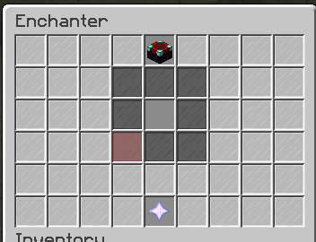
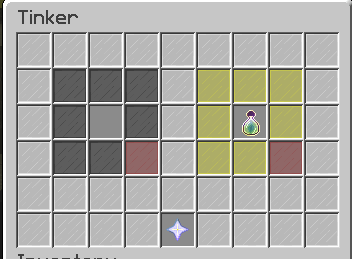
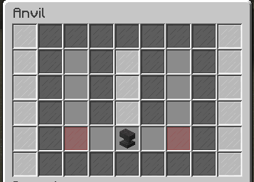

# GUIs

## Custom GUI

A custom GUI, graphical user interface, is a feature within that gives players a unique way of enchanting. GUI's can be opened up by [Custom Blocks](custom-blocks.md) or with [commands](commands-and-permissions.md). Each GUI is animated, in the terms of items  moving around within the GUI while the player is interacting with it.&#x20;

### Enchanter

As first GUI to be introduced to Custom Enchants+, it is definitely also the most important. The Enchanter is to be used to add [Enchantments](enchants.md). The Enchanter will refuse items with no remaining slots. The Enchanter will also refuse items types that are not able to be enchanted.&#x20;

#### Upgrading Existing Enchantments

The Enchanter has a chance to increase an item's already-existing enchantments when enchanting. The default percentage is 50%. This percentage can be configured within the [config.yml](configuration-files/config.yml.md). Every successful upgrade will roll a chance for an upgrade again. So by default: one upgrade is a 50% chance, two upgrades  is a 25% chance, three upgrades is a 12.5% chance, and so on.

### Tinkerer

The Tinkerer is a unique GUI that allows a player to remove their custom enchantments in return for EXP. The given is experience is determined by [`used_slots`](enchants.md#slots)`* enchantExpCost`. enchantExpCost is defined within the config.yml.

#### Obtaining Scrolls

[Scrolls](scrolls.md) can be obtained from tinkering. By default, each scroll has a 5% chance from tinkering, this percentage can be configured in the config.yml.

### Anvil

The Anvil GUI allows a player to forge two items together. At least one item must contain a custom enchantment to be utilized. The Anvil does support Vanilla enchantments. Forging two items costs the player experience. The total amount of experience is calculated by `the total amount of enchantments * forgeExpPerEnchantment`. Forging does not increase the max number of slots on either item. Books may be used within the Anvil GUI.

### Selector

The Selector GUI is displayed when a player activates either the [Enchantment Upgrade Scroll](scrolls.md#enchantment-upgrade) or the [Enchantment Removal Scroll](scrolls.md#enchantment-removal). It allows the user to select an enchantment for the scroll to perform its action.
