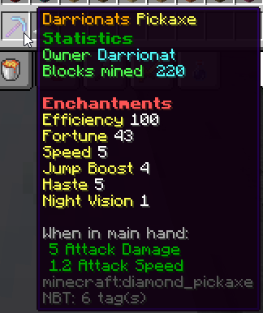

# PrisonPick

PrisonPick completely changes your Prison server and will add a fun new leveling aspect to it! Every player is given a unique pickaxe that they can upgrade with enchantments.

Fully supporting players having the same pickaxe over Bungee by using a MySQL database. Upgrades can be bought with experience levels, tokens from TokenManager, or in the future currency from Vault. A PAPI expansion can also be used to fetch player statistics.

### Features

* 6 [Custom Enchantments](enchantments.md) that can be upgraded
* A custom [GUI ](guis.md)opened when a custom pickaxe is interacted with
* Admin [commands ](commands-and-permissions.md)and a [HelpGUI ](guis.md#help-gui)that gives information on base and subcommands
* [TokenManager ](dependencies.md#tokenmanager)support and a [PAPI Expansion](placeholders.md)
* Extremely configurable [files](configuration-files/)
* A pickaxe [update timer](inventory-management.md#update-timer)
* [MySQL ](saving-data.md#mysql-database)support
* Option to get [enchantment data](saving-data.md) from the item instead of a file/database
* 1.8 to 1.16.x support
* Feature to [put blocks in player's inventory](inventory-management.md#blocks-to-inventory)
* Automatically [give player dropped experience](inventory-management.md#exp-to-inventory)


Note: throughout the PrisonPick Wiki, the words "custom item" are used instead of "pickaxe." This is explained in the warning [here](configuration-files/config.yml-1.0.2.md). 


















